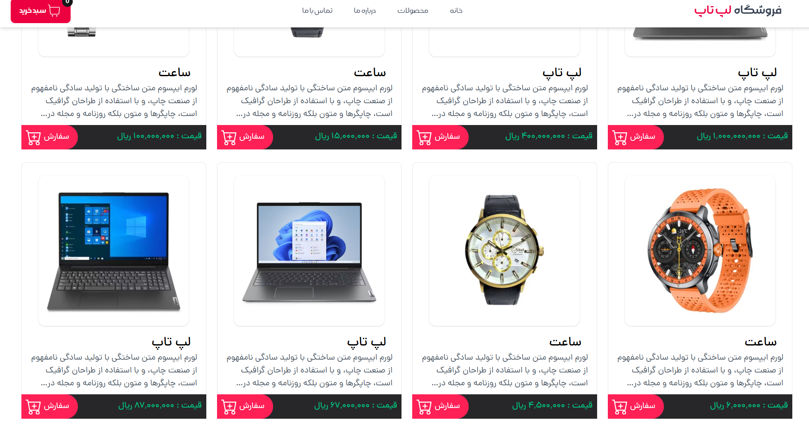
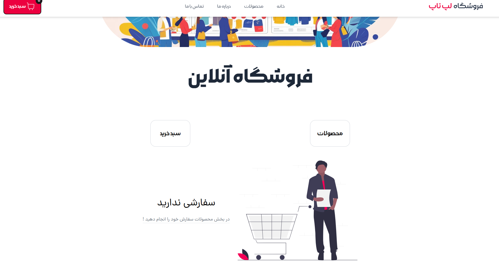

# OnlineShop - E-Commerce App (React + TypeScript + Vite)


Modern e-commerce application built with cutting-edge frontend technologies for my developer portfolio.

## 🚀 Features

- **Product Management**
  - Browse products with categories
  - Search and filtering functionality
  - Product detail pages

- **Shopping Experience**
  - Add/remove items from cart
  - Quantity adjustment
  - Checkout process

- **User System**
  - Login/registration
  - Protected routes
  - User profile section

- **Technical Highlights**
  - Type-safe React components
  - Optimized performance with Vite
  - Centralized state with Redux Toolkit

## 🛠️ Tech Stack

**Core:**
- React 18
- TypeScript 5
- Vite 4

**State & Routing:**
- Redux Toolkit 1.9
- React Router 6.8

**Styling:**
- CSS Modules (or Tailwind CSS if used)
- Responsive design

## 📦 Installation

1. Clone the repository:
   ```bash
   git clone https://github.com/Ali-Rahimpoor/demo-OnlineShop.git

Styling: TailwindCss

API: Mock API Json-server

Installation
Clone the repository:

bash
git clone https://github.com/Ali-Rahimpoor/demo-OnlineShop.git
Navigate to the project directory:

bash
cd online-shop
Install dependencies:

bash
npm install
Start the development server:

bash
npm run dev
Project Structure
src/
├── assets/            # Static assets
├── components/        # Reusable components
├── features/          # Redux slices and API logic
├── hooks/             # Custom hooks
├── pages/             # Page components
├── routes/            # Routing configuration
├── styles/            # Global styles
├── types/             # TypeScript types
├── utils/             # Utility functions
├── App.tsx            # Main App component
└── main.tsx           # Entry point
Available Scripts
npm run dev: Starts the development server

npm run build: Builds the app for production

npm run lint: Runs ESLint

npm run preview: Previews the production build

Demo
Live Demo (Add link if deployed)

Screenshots
#### 🏠 Home Page


#### 📄 Products page


#### 🛒 Shopping Cart


License
This project is open source and available under the MIT License.

Feel free to contribute or provide feedback! This project was created as part of my portfolio to showcase my skills with modern React development.
